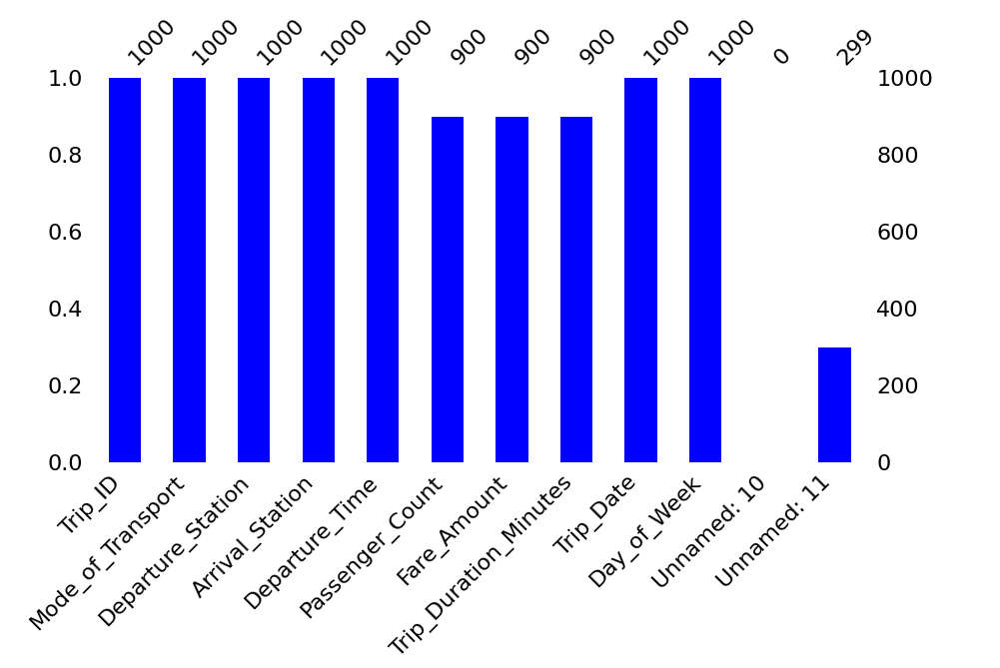
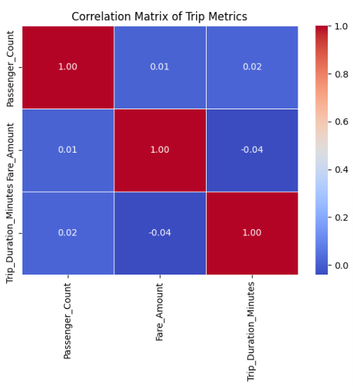
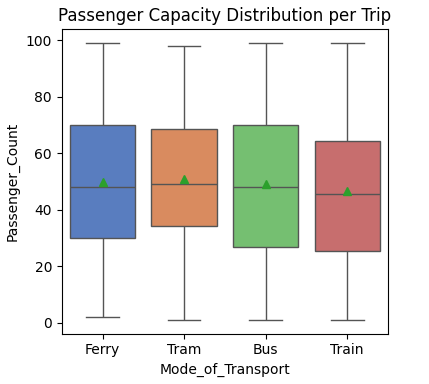

# MetroMove Transit Analytics: Optimising Modal Performance & Pricing Frameworks

## Project Overview
This project delivers an end-to-end Exploratory Data Analysis (EDA) and data preprocessing pipeline to evaluate operational efficiencies, passenger usage distributions, and revenue streams for **MetroMove**. 

Raw public transport datasets frequently suffer from systemic data-entry gaps and rigid, unoptimised pricing models. This project simulates a production-grade data science workflow: auditing data quality, engineering robust features, uncovering hidden categorical patterns, and translating statistical anomalies into high-impact strategic business decisions for senior management.

---

## Core Business Rationale & Objectives
Effective transit administration relies on a granular, data-backed understanding of how a network moves. The primary goals of this analysis are:
1. **Passenger Demands & Timelines:** Map commuter volume distributions across transit stations and track how demand fluctuates across the days of the week.
2. **Modal Operational Audit:** Quantify the financial bottom line of different transport options (Bus, Ferry, Train, Tram) and evaluate whether vehicle capacities match real-world passenger foot traffic.
3. **Pricing Elasticity & Cost Recovery:** Analyse the relationship between trip durations and ticket fares to ensure operational overheads (fuel, maintenance, asset wear-and-tear) are appropriately recovered.

---

## Tech Stack & Analytical Methodologies
* **Environment:** Python 3 (Google Colab / Jupyter Notebooks)
* **Core Data Engine:** Pandas & NumPy (Data manipulation, feature parsing, and matrix aggregation)
* **Data Visualisation Suite:** Matplotlib & Seaborn (Univariate distribution modeling, categorical profiling, and multivariate correlation)
* **Statistical Imputation:** Structured Group-Median Imputation to resolve systemic missing data gaps.

---

## Feature Engineering, & Cleaning Footprints

### 1. High-Fidelity Data Cleaning
During the initial data audit, critical missing records were identified across ticket fares, passenger counts and trip lengths. To preserve sample sizes without introducing massive statistical variance, a **systematic median imputation strategy** was deployed. The Missing  value visualisation is shown below.

**Fig1: Distribution of Missing Value**

**The Footprint:** This data choice left highly distinct, non-organic structural footprints within final distributions, specifically a sharp, synthetic spike at the **£26 fare amount** and a dominant vertical column at the **100-minute mark for trip durations**. Identifying these artifacts ensures that data engineering decisions are cleanly decoupled from organic consumer behaviour.

### 2. Feature Engineering: The 'Route' Metric
To map transit movement accurately, raw standalone station coordinates were consolidated and engineered into a composite categorical metric: **`Route`** (defined as `Departure_Station` to `Arrival_Station`). This granular transformation allowed for the isolation of network-wide commuting patterns that simple univariate counts completely obscure.

---

## Key Analytical Insights & Red Flag Synthesis

### 1. Structural Decoupling of the Pricing Matrix (Core Inefficiency)
The single biggest analytical exposure uncovered by the pairplot grid and correlation matrix ($0.01$, $0.02$, and $-0.04$ coefficients) is that **MetroMove’s pricing structure is completely decoupled from trip characteristics**. 
Under a sustainable economic model, fare amount should scale alongside fuel consumption, trip times, and vehicle crowding. Instead, the scatter plots resemble random noise; a 15 minute journey can cost identical to a 3-hour journey. This proves the system is operating on rigid flat-rate pricing structures that cause severe revenue leaks on long-haul routes. The Correlation Matrix is shown in Fig. 2.

Fig.2: Correlatiom Matrix of Trip metrics

### 2. Asset Capacity & Demand Mismatch
While a train or ferry possesses a massively superior physical asset capacity compared to a standard bus, the boxplot analysis reveals that the passenger count distribution per trip is practically uniform across all modes, hovering around a median of **45 to 50 passengers**. 
MetroMove is heavily under-utilising its highest-capacity infrastructure. The network is moving empty space on its rail and water lines while overworking its bus assets. Furthermore, the upper quartile ($Q_3$) sits at **70 passengers**, meaning 75% of all network operations run well below full volume. Fig.2 illustated the boxplot below.

Fig. 3 : Passenger Capacity Distribution Per Trip

### 3. Weekly Revenue Distribution by Transport Mode
The multivariate visualisation shows that **Buses dominate as the network’s primary financial engine**, pulling in the highest total revenue and daily passenger preference. **Ferries** provide a steady, highly reliable secondary stream of income. However, Trams consistently generate the lowest revenue across the entire week.

### 4. Economic Anchors & Logging Anomalies
The top 10 route frequency analysis shows that **North Station to the Airport** and **Central to the Airport** are the absolute heaviest corridors. The Airport features in nearly half of the top ten busiest routes, proving it is the network's main economic anchor.
**Operational Quirk:** The pipeline caught highly anomalous circular loops, such as journeys logged as *Airport-to-Airport* and *Downtown-to-Downtown*. In a public system, these point directly to localized airport shuttles or minor automated data-logging failures where vehicle drivers forgot to reset terminal destinations at the end of a shift.

Fig 4: Top 10 Most Frequent Transit Routes

---

## Recommendations & Data-Driven Action Plan

Based on the empirical insights above, the following actions are recommended to optimize MetroMove's operations and protect its profit margins:

*   **Transition to Distance-Based Pricing:** Overhaul the static pricing matrix. Implement a tiered or distance-based fare structure to re-couple ticket prices with travel times, ensuring long-haul trips offset their actual asset maintenance and fuel costs.
*   **Implement Fleet Rightsizing:** Use the $Q_3$ capacity metric to justify rightsizing the off-peak fleet. Deploy smaller, fuel-efficient transit units when demand falls below 70 passengers, and launch targeted marketing or loyalty frameworks to actively incentivize passengers to shift from congested bus corridors to under-utilised train and ferry networks.
*   **Activate Weekend Rail Services:** Restructure the rail timetable to introduce targeted Saturday and Sunday schedules. This capitalises on high-volume weekend leisure demand, unlocks fresh revenue streams, and maximises the return on fixed rail infrastructure investments.
*   **Streamline High-Traffic Airport Corridors:** Establish dedicated express transit channels, higher vehicle frequencies, and optimised platform layouts for the *North Station* and *Central* routes to the *Airport* to maximize daily ticket volume where consumer demand is highest.
*   **Enforce Strict Software Data Governance:** Embed validation constraints into the automated logging applications to eliminate artificial loops (*Airport-to-Airport*). Improving data capture integrity at the source minimizes reliance on statistical median imputations, giving future business analysts cleaner data for strategic planning.
